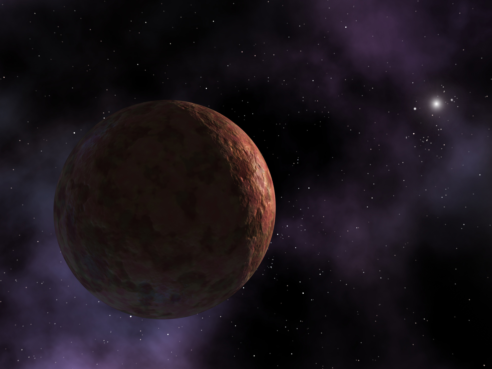

# markdown-ejemplo
los gatos son titulos, entre mas gatos mas pequeños
## este es un segundo titulo
`esta es una linea de codigo`
`bash miscripts`
### Ahora vamos a hacer una lista
- primer elemento
- segundo elemento
  * dos
  * uno
     1. hola
     2. hola

### links
[jscape] (https://www.jscape.com/blog/how-to-ftp-a-file)

👀 🐈‍⬛ (❁´◡`❁)(●'◡'●)╰(*°▽°*)╯
con windows+ se despliegan todos los stickers

